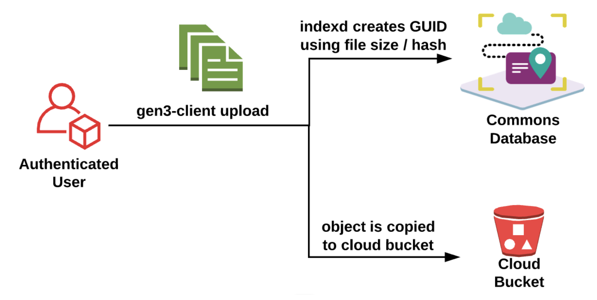

<div>

</div>

# Indexd

 [](LICENSE) [](https://travis-ci.org/uc-cdis/indexd) [](https://coveralls.io/github/uc-cdis/indexd?branch=master)

Indexd is a hash-based data indexing and tracking service providing 128-bit globally unique identifiers. It is designed to be accessed via a REST-like API or via a client, such as the [reference client implementation](https://github.com/uc-cdis/indexclient). It supports distributed resolution with a central resolver talking to other Indexd servers.

For more about GUIDs and an example of a central resolver, see [dataguids.org](https://dataguids.org).

---

<div>

</div>

_Indexd is a vital microservice used in the [Gen3 Open Source Software Platform](https://gen3.org). Gen3 is used for developing data commons that colocate compute and storage. Data commons accelerate and democratize the process of scientific discovery, especially over large or complex datasets._

---

## The Problem That Indexd Solves

<div align="center">

</div>

Data inevitably moves and changes, which leads to unreproducible research. It's not uncommon for physical data to be moved from one storage location to another, for domain names to change, and/or for data to exist in multiple locations.

If you run an analysis over a set of data and later it gets moved, your analysis is no longer repeatable. The same data still exists, it just isn't where you thought.

This presents a huge problem for repeatable research. There needs to be a unique identifier for a given piece of data that can be used in analyses without "hard-coding" the physical location of the data.

<div>

</div>

## The Solution: Indexd's Globally Unique Identifiers (GUIDs)

Indexd serves as an abstraction over the physical data locations, providing a Globally Unique Identifier (GUID) per datum. These identifiers will always be resolvable with Indexd and will always provide the locations of the physical data, even if the data moves.

> Data GUIDs were created by the Data Biosphere - a vibrant ecosystem for biomedical research containing community-driven standard-based open-source modular and interoperable components that can be assembled into diverse data environments.

GUIDs provide a domain-neutral, persistent and scalable way to track data across platforms. Indexd is a proven solution to provide GUIDs for data.

---

## Technical Details

**Quick Links:**

* [View API Documentation](http://petstore.swagger.io/?url=https://raw.githubusercontent.com/uc-cdis/Indexd/master/openapis/swagger.yaml)
* [Installation Instructions](#installation)
* [Use Cases for Indexing Data](#use-cases-for-indexing-data)

Indexd is a two-layer system. On the bottom layer, each data object has a GUID and hashes that map to known physical locations of the data.

The second layer is aliases. **Aliases** are user-defined, human-readable identifiers that map to GUIDs. This adds the flexibility of supporting human-readable identifiers and allow referencing existing identifiers (such as DOIs and ARKs) that are created in other systems.

<div align="center">

</div>

GUIDs are primarily used to track the current location of data as it is moved or copied from one location to another. The GUID itself is at minimum 128-bits, as a [UUID](https://tools.ietf.org/html/rfc4122.html) is used as the base. Additionally, a prefix can be prepended to this UUID, which lengthens the identifier even further (this is used primarily to assist in [distributed resolution](#distributed-resolution-utilizing-prefixes-in-guids)). If you want a shorter identifier, you can use the aliases defined above to create a different, unique mapping to GUIDs.

Data GUIDs with a prefix are structured as follows:

`dg.[resourceId]/[128-bit UUID]`

* All data GUIDs with optional prefixes begin with the characters: `dg`
* The second component in a data GUID is a unique string that
identifies a resource that can resolve the data GUID. Prefixes are assigned by
the [Open Commons Consortium](http://occ-data.org/). There is no charge for being
assigned a data GUID prefix, but the organization that is assigned the prefix must
maintain a service that dereferences data GUIDs associated with that prefix.
* The third component in a data GUID is 128 UUID following IETF RFC 4122

GUIDs can be assigned to entities in object storage, as well as XML and JSON documents. The current location(s) of a particular datum is reflected in the URL list contained within Indexd.

As the same datum may exist in multiple locations, there may be more than one URL associated with each GUID. The ability to actually access the URL provided by Indexd is done on the client site.

> Clients must provide capabilities to access URLs specified in Indexd. Gen3 Auth (specifically the [Fence](https://github.com/uc-cdis/fence) service) is capable of creating signed URLs for accessing data.

The client has to be able to interpret the protocol encoded in the URL. This is similar to a browser accessing HTTP and FTP transparently by having it encoded in the URL. If a client comes across a URL that it doesn’t know how to access, it can report an error and the user may have to use a different client to access that URL.

All the information about a specific datum mentioned above (the GUID, URLs, hashes, file size, access control, etc.) are bundled together and referred to internally as an **Indexd record**.

### Indexd Records

Records are collections of information necessary to as-uniquely-as-possible identify a piece of information. This is done through the use of hashes and metadata. Records are assigned a UUIDv4 at the time of creation and additionally may include a prefix to aide in resolution (these combined become the GUID). This allows records to be uniquely referenced amongst multiple records.

Hashes used by the index are deployment-specific but are intended to be the results of widely known and commonly available hashing algorithms, such as MD5 or SHA1. This is similar to the way that torrents are tracked and provides a mechanism by which data can be safely retrieved from potentially untrusted sources in a secure manner.

Additional metadata that is stored in index records includes the size of the data as well as the type.

**Example record with relevant fields:**

```javascript
{
    did: "dg.4242/000003f6-a029-421a-bc84-a9777b7c34a5",
    urls: [
        "gs://some-google-storage-bucket/some-file.txt",
        "s3://some-s3-bucket/some-file.txt"
    ],
    hashes: {
        md5: "f7b38502322197f60a5af8e530fa376e"
    },
    size: 42,
    acl: [
        "example",
        "test"
    ],
    authz: [
        "M7cIajvg"
    ],
    rev: "2013243e",
    baseid: "84c0843e-c685-4dg8-953a-8b8f354fc198",
    file_name: null,
    uploader: null,
}
```

* `did`: The GUID, AKA Digital Identifier (did)
* `urls`: storage locations for the actual data
* `hashes`: a dictionary of hash algorithms to hashes
* `size`: file size in bytes
* `acl`: access control list with strings identifying required authorizations
* `authz`: preferred over `acl`, anything here will have priority
  * a list of strings representing resources (or resource tags) in Gen3's Authorization Service, [Arborist](https://github.com/uc-cdis/arborist) that user must have access to in order to access the data
* `rev`: the current revision (for avoiding conflicts)
  * See [next section](#avoiding-conflicts-on-updates) for more details
* `baseid`: the base identifier linking logically similar GUIDs
  * See [Data Version Control](#data-version-control) for more details
* `file_name`: an optional name for the file that will be searchable through Indexd's API
* `uploader`: who uploaded the file (when using the flow described later on about [blank records](#blank-record-creation-in-indexd))

### Avoiding Conflicts on Updates

In order to avoid update conflicts for frequently updated GUIDs, Indexd uses a revisioning system similar to that utilized in distributed version control systems. Within a particular GUID, this mechanism is referred to as the **revision** or **rev**.

For an update to take place, both the GUID and the revision must match that of the current Indexd record. When any update succeeds, a new revision is generated for the Indexd record. This prevents multiple, conflicting updates from occurring. The revision is an opaque string and is
not used for anything other than avoiding update conflicts.

### Data Version Control

It is possible that specific data needs to be updated, but should still be logically related to previous versions of that data. It may also be the case that there were errors in previous data that are corrected in future versions.

It is still true, however, that **GUIDs should be persistent and the data they point to should be immutable**. Meaning that a GUID will always refer to the same data. The idea of a new version requires a _new_ GUID for that data (if the hash and file size have changed).

> The question is: how do you maintain a logical linking between different versions or updates for the same data?

To handle this versioning in Indexd, the concept of a `baseid` is introduced. The `baseid` is a UUID that all versions of the data (in other words, all GUIDs) point to. The `baseid` logically groups the "same" data.

It is then possible (via the API) to retrieve all versions for a given GUID. In addition, it is possible to ask for the _latest_ version of a GUID. See the [API documentation](http://petstore.swagger.io/?url=https://raw.githubusercontent.com/uc-cdis/Indexd/master/openapis/swagger.yaml#/index/getLatestVersion) for more details.

To reiterate, a given GUID will always point to the same data, even if there are later versions. The later versions will have _different_ GUIDs, though they will be connected through a common `baseid`. The Indexd API makes it possible to programmatically determine if newer versions of a given datum exist.

### Access Control

Indexd records (identified by GUIDs) are intended to be publicly readable documents, and therefore contain no information other than resource locators. However, in order to prevent unauthorized
creation/updating/deleting of records, each record keeps a list of authorization rules (in an `authz` property).

The `authz` property contains a list of abstract "resources" a user must have access to in order to have permission to update/delete the associated GUID. For backward compatibility, the ACL list that was used for access control is still available (the `acl` field).

If Indexd is used with other Gen3 software, specifically the services related to Gen3 Auth ([Fence](https://github.com/uc-cdis/fence) and [Arborist](https://github.com/uc-cdis/arborist)), it enables a more useful and robust access control system that exposes various data access methods securely by utilizing the `authz` field in Indexd.

The additional usage of the Gen3 Auth services will enable data access through signed URLs, with authorization checks based on the `authz` field in Indexd.

### Distributed Resolution: Utilizing Prefixes in GUIDs

<div align="center">

</div>

If you know the URL of a particular Data GUID resolution service (like Indexd), which is associated with a particular prefix, you can directly access that service to get the relevant record.

Otherwise, you can access a centralized resolver like [dataguid.org](dataguid.org), which will resolve you to the data GUID service associated with the GUID's prefix.

Indexd's distributed resolution logic for a given GUID/alias is roughly as follows:

1. Attempt to get a local record with given input (as GUID)
2. Attempt to get a local record with given input (as alias)
3. Attempt distributed resolution using connected services configured in Indexd's `DIST` config
  * It is possible to resolve to a service that is *not* another Indexd, provided that a sufficient client is written to convert from the existing format to the format Indexd expects
    * Currently we have a [DOI Client](https://github.com/uc-cdis/doiclient) and [GA4GH's DOS Client](https://github.com/uc-cdis/dosclient)
        * [More info on DOIs](http://www.doi.org/)
        * [More info DOS](https://github.com/ga4gh/data-repository-service-schemas)
            * NOTE: Was renamed to DRS
        * Resolving to servers with other identifiers, like [ARK IDs](http://n2t.net/e/ark_ids.html) could be supported if a client was created (otherwise, you can use the _aliases_ in Indexd to simply map from an existing identifier to a GUID)
        * We have a [GA4GH DRS Implementation](./docs/drs.md) which includes bundles.
  * The distributed resolution can be "smart", in that you can configure `hints` that tell a central resolver Indexd that a given input should be resolved with a specific distributed service
    * The `hints` are a list of regexes that will attempt to match against given input
    * For example: `hints: ["10\..*"]` for DOIs since they'll begin with `10.`

An example configuration (see [configuration section](#configuration) for more info) for an external service to resolve to:

```python
CONFIG["DIST"] = [
    {"name": "DX DOI", "host": "https://doi.org/", "hints": ["10\..*"], "type": "doi"},
]
```

The `type` tells Indexd which client to use for that external service. In this case, `doi` maps to the [DOI Client](https://github.com/uc-cdis/doiclient).

Indexd itself can be configured to append a prefix to the typical UUID in order to aide in the distributed resolution capabilities mentioned above. Specifically, we can add a prefix such as `dg.4GH5/` which may represent one instance of Indexd. For distributed resolution purposes, we can then create `hints` that let the central resolver know where to go when it receives a GUID with a prefix of `dg.4GH5/`.

The prefix that a given Indexd instance uses is specified in the `DEFAULT_PREFIX` configuration in the settings file. In order to ensure that this gets used, set `PREPEND_PREFIX` to `True`. Note that the prefix will only be prepended to GUIDs generated for new records that are indexed _without_ providing a GUID.

The `ADD_PREFIX_ALIAS` configuration represents a different way of using the prefix: if set to `True`, instead of prepending the prefix to the GUID, indexd will create an alias of the form `<prefix><GUID>` for this record. Note that you should NOT set both `ADD_PREFIX_ALIAS` and `PREPEND_PREFIX` to `True`, or aliases will be created as `<prefix><prefix><GUID>`.

If a `DEFAULT_PREFIX` is configured, certain endpoints may take extra steps to resolve a local GUID based on this. The GET `/{GUID}`, `/index/{GUID}`, and DRS endpoints will all accept either the prefixed or unprefixed version of the GUID, regardless of whether the `PREPEND_PREFIX` or `ADD_PREFIX_ALIAS` condiguration is being used. However, any other endpoint that takes a GUID will only accept the exact `did` as stored in the database, so it is best to use that field from the record for subsequent requests.

## Use Cases For Indexing Data

Data may be loaded into Indexd through a few different means:

### I want to upload data to storage location(s) and index at the same time

Using the [gen3-client](https://gen3.org/resources/user/gen3-client/) you can upload objects to storage locations and mint GUIDs at the same time.

<div align="center">

</div>

#### Blank Record Creation in Indexd

Indexd supports void or blank records that allow users to pre-register data files through Fence before actually registering them. This enables the [Data Upload flow](https://gen3.org/resources/user/submit-data/#2-upload-data-files-to-object-storage) that allows users to use a client to create Indexd records before the physical file exists in storage buckets. The complete flow contains three main steps:

1) pre-register
2) hash/size/URL populating
3) data node registration

General flow:

1) Fence requests a blank object from Indexd. Indexd creates an object with no hash, size or URLs, only the `uploader` and optionally `file_name` fields.
2) The Indexd listener ([indexs3client](https://github.com/uc-cdis/indexs3client) jobs dispatched by the [ssjdispatcher](https://github.com/uc-cdis/ssjdispatcher)) monitors bucket updates and updates Indexd with the URL, hash and size of the objects.
3) The client application (windmill or gen3-data-client) lists records for data files which the user needs to submit to the graph. The user fills all empty fields and submits the request to Indexd to update the `authz` or `acl`.

> NOTE: Step 2 above fulfills the use case of dynamically indexding data added to storage buckets [discussed later on](#automatically-creating-indexd-records-when-objects-are-added-to-object-storage).

### I want to associate Indexd data to structured data in a Gen3 Data Commons

> NOTE: This assumes that the data already exists in storage location(s)

#### Indexd Record Creation Through Gen3's Data Submission Service: [Sheepdog](https://github.com/uc-cdis/sheepdog)

When data files are submitted to a Gen3 Data Commons using Sheepdog, the files are automatically indexed into Indexd. Submissions to Sheepdog can include `object_id`'s that map to existing Indexd GUIDs. Or, if there are no existing records, Sheepdog can create them on the fly.

To create Indexd records on the fly, Sheepdog will check if the file being submitted has a hash & file size matching anything currently in Indexd and if so uses the returned document GUID as the object ID reference. If no match is found in Indexd then a new record is created and stored in Indexd.

### I want to index data that is dynamically added to storage location(s)

#### Automatically Creating Indexd Records when Objects are Added to Object Storage

Using AWS SNS or Google PubSub it is possible to have streaming notifications when files are created, modified or deleted in the respective cloud object storage services (S3, GCS). It is then possible to use an AWS Lambda or GCP Cloud Function to automatically index the new object into Indexd.

> NOTE: This may require using the batch processing services if the file is large (to compute the necessary minimal set of hashes to support indexing). There are known limitations with AWS Lambda and GCP Cloud Functions related to how long a process can run before AWS/Google cuts it off. Some hash calculations may exceed that time limit.

This feature can be set up on a per Data Commons basis for any buckets of interest. The buckets do not have to be owned by the commons, but permissions to read the bucket objects and permissions for SNS or PubSub are necessary.

For existing data in buckets, the SNS or PubSub notifications may be simulated such that the indexing functions are started for each object in the bucket. This is useful because only a single code path is necessary for indexing the contents of an object.

We have a solution for AWS discussed in the ["Blank Record Creation in Indexd" Section](#blank-record-creation-in-indexd).

## Indexd REST API for Record Creation

It is also possible to interact directly with the Indexd API in order to create index records. There are two options for authorization for these sorts of updates.

1) Use Basic Auth (username/password) to provide administrative control over Indexd

You can use the `/bin/indexd_admin.py` to add a new username and password combination to Indexd.

_and/or_

2) Use the Gen3 Auth services ([Fence](https://github.com/uc-cdis/fence) and [Arborist](https://github.com/uc-cdis/arborist)) to control access based on access tokens provided in requests

Similar to other Gen3 services, users must pass along their Access Token in the form of a JWT in the `Authorization` header of their request to the Indexd API. Indexd will check that the user is authorized for the items in the `authz` field by passing along your token and the action you're trying to do to the [Arborist](https://github.com/uc-cdis/arborist) service.

## Standards and Governance

CTDS (maintainers of Indexd) are working with the not-for-profit Open Commons Consortium to assign Data GUID Prefixes to organizations that would like to run a Data GUID service.

In addition, one of our goals is to work with GA4GH to ensure Data GUIDs and Indexd comply with the GA4GH standard. We are also working in parallel to establish Data GUIDs as an Open Commons Consortium (OCC) standard.

---

## Installation

Please see how you can set up a [local development environment](docs/local_dev_environment.md), which includes setting up a [virtual environment](docs/local_dev_environment.md#Set-up-a-Virtual Environment) and setting up a [local postgresql db for testing](docs/local_dev_environment.md#Set-up-local-Postgresql-DB-for-testing).

## Configuration

As part of setting up your [local development environment](docs/local_dev_environment.md), you will also need to [configure settings](docs/local_dev_environment.md#Configuration) too.

## Testing

- Follow [installation]([local development environment](docs/local_dev_environment.md#installation)
- Check the [testing notes](docs/local_dev_environment.md#Testing) and run:
```console
python3 -m pytest -vv --cov=indexd --cov-report xml --junitxml="test-results.xml" tests
```

### Quickstart with Helm

You can now deploy individual services via Helm!
Please refer to the Helm quickstart guide HERE (https://github.com/uc-cdis/indexd/blob/master/docs/quickstart_helm.md)

<div align="center">

</div>
